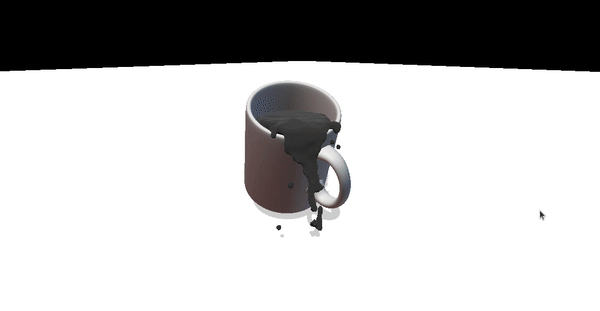

# Threejs introductory exercise

## What are we building

## Getting started

This project uses the following:

- Nodejs v14
- Webpack v5

### Setup

Run either `yarn` or `npm i` to install.

Use `yarn start` to start the application in develop mode. The application should run at [http://localhost:8080](http://localhost:8080/). If not, check your terminal.

To build for production, run `yarn build`. The build files can be found in the `dist/` folder. If you wish to run these files use [Pythons simple http server](https://developer.mozilla.org/en-US/docs/Learn/Common_questions/set_up_a_local_testing_server).

## Exercise

1. Explore the code

For this exercise there already is a proper setup to get you started. Check it out and try to figure out yourself what it does. Not sure what a function is? Check the [documentation](https://threejs.org/docs/index.html#manual/en/introduction/Creating-a-scene).

2. Let's add some shapes

Three.js already has multiple geometries built in. Place 2 in the scene in different locations.

**BONUS**: Use different materials for the geometries and see what effect it has.

3. Shadows

In the setup shadows are already set up in both the renderer and lighting but for the newly added geometries there are no shadows yet. Make sure they [cast a shadow](https://threejs.org/docs/index.html?q=mesh#api/en/core/Object3D.castShadow).

4. Loading a model

Perhaps you've already seen it but we have an assets folder with a `.gltf` file in it. Try to load this model into your scene using the [GLTFLoader](https://threejs.org/docs/index.html?q=gltf#examples/en/loaders/GLTFLoader).

**BONUS**: Use the DRACOLoader together with the GLTFLoader for compressed geometries. You can find an example of this on the documentation page of the GLTFLoader. For the draco `decoderPath` use the url `https://www.gstatic.com/draco/v1/decoders/`.

**BONUS 2**: Just like with the geometries, now make sure the model also casts a shadow. To do this you might need to look into the gltf's scene for its children.

5. Textures

You can do a lot of fun stuff with textures, see [this](https://threejs.org/examples/?q=text#webgl_loader_texture_dds) example. Now let's add our own texture to the model we just added. For this we first need to load a texture using the [TextureLoader](https://threejs.org/docs/index.html?q=text#api/en/textures/Texture). Use the `clay_studio` texture in the assets folder.

6. Bonus step: post-processing

Let's now add a nice post-processing effect over the scene. Checkout the [guild](https://threejs.org/docs/index.html?q=post#manual/en/introduction/How-to-use-post-processing) for it and add the `RenderPass` and `GlitchPass` to the `EffectComposer`. Be sure to replace the `renderer.render()` function with the correct function of the `EffectComposer`.
